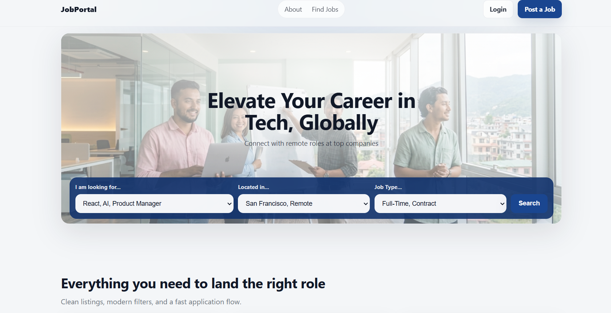
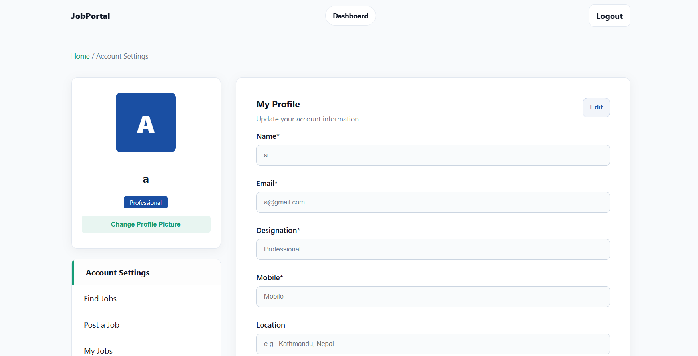

# 💼 Job Portal

A modern job portal web app where candidates can discover jobs, save roles,
apply for openings, and manage their profile, while employers can post jobs and
review applicants from a clean dashboard.

🔗 **Live Demo:** [job-portal-demo.netlify.app](https://.../)

![Job Portal Preview]
## ✨ Features

- 🔐 User signup and login flow
- 🔎 Browse and search job listings
- 🧰 Filter jobs by category, location, type, and posted date
- 💾 Save jobs for later using LocalStorage
- 📩 Apply to jobs and track submitted applications
- 📝 Post new jobs with draft-saving support
- 📋 Employer dashboard for posted jobs and applicants
- 👤 Account/profile settings for logged-in users
- 📱 Responsive layout for desktop and mobile screens

## 🛠️ Tech Stack

- HTML5, CSS3, JavaScript (ES6+)
- Node.js and Express.js
- LocalStorage and SessionStorage APIs
- dotenv and CORS

## 📸 Screenshots

![Home]


<!-- Add more screenshots when available -->
<!--  -->
<!--  -->
<!--  -->

## 🚀 How to Run Locally

```bash
git clone https://github.com/yourname/job-portal.git
cd job-portal
npm install
npm run dev
```

Open the app in your browser:

```bash
http://localhost:3000
```

## 📁 Project Structure

```bash
job-portal/
├── assets/
│   └── image/
├── css/
│   ├── dashboard.css
│   ├── findjobs.css
│   ├── login.css
│   ├── signup.css
│   └── style.css
├── js/
│   ├── account.js
│   ├── auth.js
│   ├── dashboard.js
│   ├── myjob.js
│   ├── postjob.js
│   └── profile.js
├── index.html
├── findjobs.html
├── dashboard.html
├── post-job.html
├── saved.html
├── applied.html
├── my-jobs.html
├── my-appliers.html
├── server.js
└── package.json
```

## 💡 What I Learned

- Building multi-page web app navigation
- Creating authentication-like flows with browser storage
- Managing saved, posted, and applied job data with LocalStorage
- Designing dashboard pages for both candidates and employers
- Serving a static frontend with an Express.js server

## 🔮 Future Improvements

- [ ] Add a real backend database
- [ ] Add secure authentication and authorization
- [ ] Upload resumes during job applications
- [ ] Add company profiles and job status controls
- [ ] Send email notifications for applications
- [ ] Deploy the project with a production-ready API

## 📬 Contact

**Aayush Gurung** - [LinkedIn](https://www.linkedin.com/in/aayush-gurung-9339923b3/) - [nabin.laghey.official@email.com](mailto:your@email.com)
